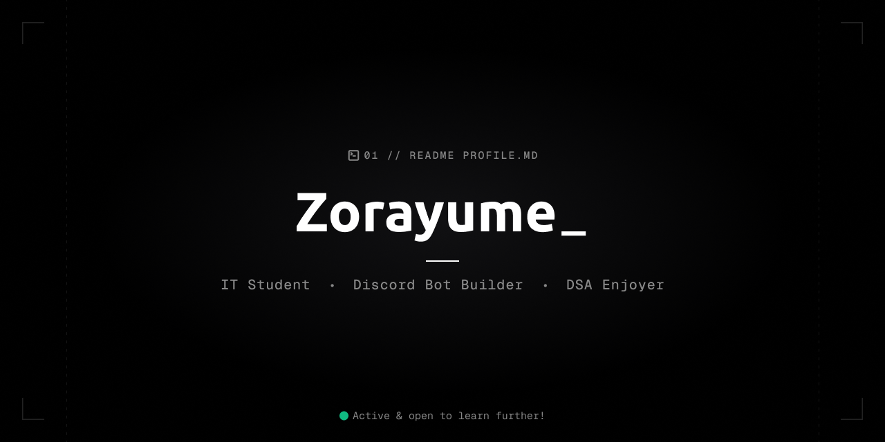

<table>
  <tr>
    <td width="55%" valign="top">
      
      

        
      

    </td>
    <td width="45%" valign="middle">
      <h1 align="center">Hi there, I'm Ray 👋</h1>
      

        <strong>DSA Enjoyer • Discord Bot Builder • Curious Web3 Students</strong>
      

      

        I build practical and easy, polished experiences with curiosity, code, and a strong love for learning.
      

      

        
        
        
        
      

    </td>
  </tr>
</table>

---

  
 &nbsp
  

---

## ✨ About Me

I’m a builder at heart who likes turning ideas into polished experiences. My workflow blends problem-solving, clean architecture, and a strong curiosity for expanding my stack.

- 💡 Hobbies: reading, journaling, exploring new tech, walking, and watching anime after a long coding session!
- 🌱 Currently learning: More Javascript, Solidity, and AI/ML.
- 🖥️ Preferred environments: Arch Linux, Debian, and Windows 11

  
  
  

---

### ✍️ Random Dev Quote

  

---

## 🧠 Tech Stack

### Languages

  
  
  
  
  
  

### Frameworks & Libraries

  
  
  
  
  
  

### Currently Exploring

  
  
  
  
  
  
  
  

---

## 🚀 Project Ongoing

<table>
  <tr>
    <td><strong>Project</strong></td>
    <td><strong>Focus</strong></td>
    <td><strong>Details</strong></td>
  </tr>
  <tr>
    <td><a href="https://github.com/zorayume/SerenaCrypt">SerenaCrypt</a></td>
    <td>Discord Bot</td>
    <td>Roleplays the web3 simple ecosystem, providing the best usage.</td>
  </tr>
  <tr>
    <td><a href="https://github.com/zorayume/Sorafi">Sorafi</a></td>
    <td>Minecraft Utility Mod</td>
    <td>A mod that enchance gameplay, displays a lot of customizable HUDs.</td>
  </tr>
</table>

---

## 📊 GitHub Activity

  

  

  

---

## 🔗 Social Links

  
  
  
  
  
  
  

